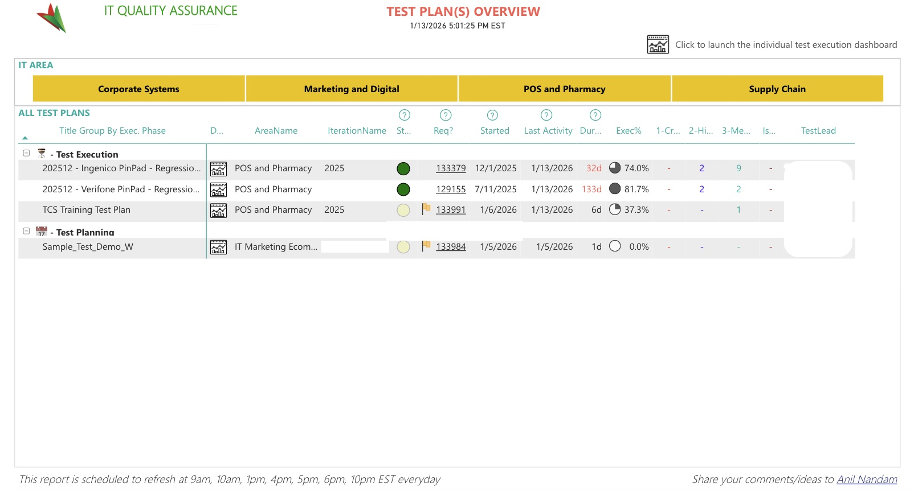
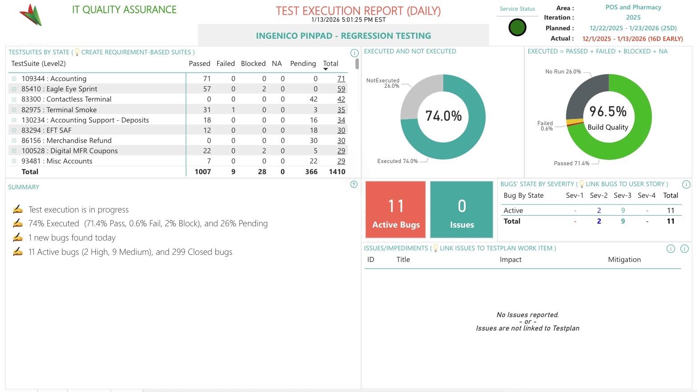
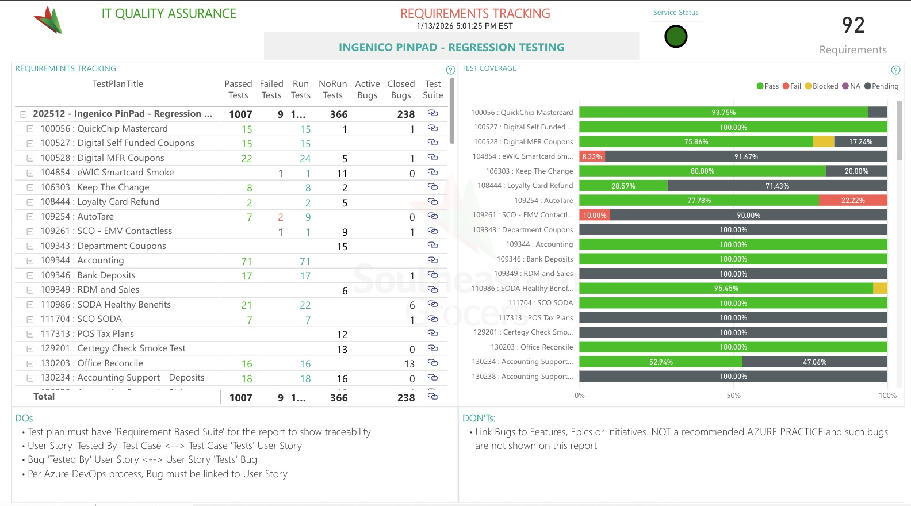
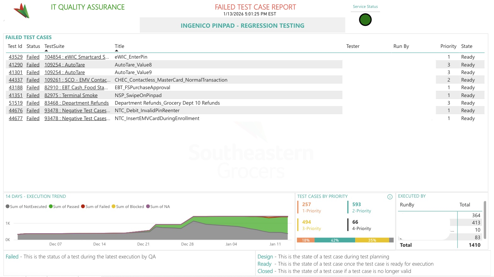
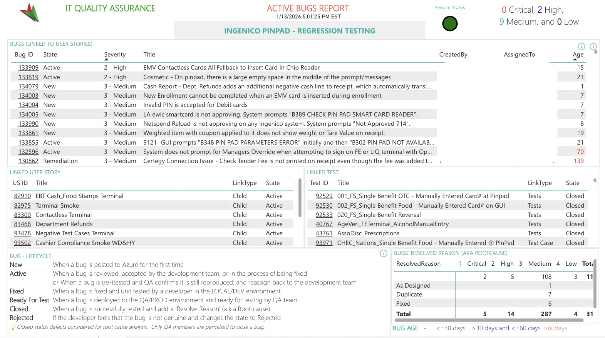
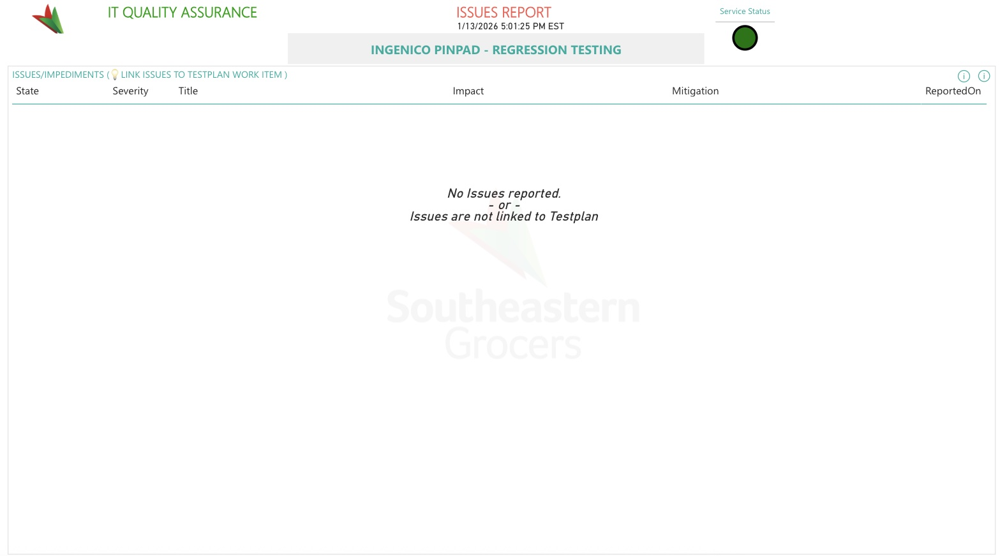

# Enterprise Quality & Test Management Dashboard
**Azure DevOps Integration via Power BI Fabric**

## Overview
This enterprise-level reporting solution provides end-to-end visibility into test management, execution, and quality metrics. By integrating **Azure DevOps Analytics (OData)** and **REST APIs**, it serves as a central "source of truth" across all IT business areas, including Corporate Systems, Marketing, and POS/Pharmacy.

> This central “source of truth” now provides visibility across all IT areas such as including Corporate Systems, Marketing,  POS/Pharmacy and any Areas defined in DevOps Organization.

## Business Value
- **Transparency:** Real-time QA transparency for both leadership and delivery teams.
- **Efficiency:** 100% elimination of manual spreadsheet-based status tracking and reporting effort.
- **Risk Mitigation:** Faster identification of coverage gaps, quality trends, and execution bottlenecks.
- **Standardization:** Unified QA metrics across diverse IT business units.

## Technical Architecture
- **Data Integration:** Combines Azure DevOps OData queries, REST APIs, SQL Server tables, and Excel datasets.
- **Semantic Modeling:** Scalable model consolidating Test Plans, Suites, Runs, and Points alongside User Stories, Bugs, and Requirements.
- **Automated Distribution:** Local PowerShell scripts extract high-priority metrics from the semantic model to send automated status emails to stakeholders twice daily.

## Key Capabilities

### Executive Dashboard - QA Overview
- Organization-wide visibility across all active IT test plans.
- Real-time tracking of execution phases (Planning vs. Execution).
- Critical metrics: Execution %, duration, last activity, and ownership.
- **Deep-Dive Navigation:** Interactive drill-down from summary views to detailed execution analytics for individual test plans.

*High-level visibility across Corporate, Marketing, and POS/Pharmacy and other IT/Business areas.*

### 1. Test Execution & Quality Analytics
- **Live Status Tracking:** Real-time visibility into Passed, Failed, Blocked, NA, and Pending statuses.
- **Build Quality Indicators:** Automated pass/fail ratios to identify execution gaps instantly.
- **Trend Analysis:** 14-day execution trends using stacked area charts to visualize velocity and stability.

*Real-time metrics showing 74% execution and 96.5% build quality.*

### 2. End-to-End Traceability
- **Requirement-to-Defect Mapping:** Full visibility from User Stories to Test Cases to Bugs.
- **Compliance Monitoring:** Automated visualization of requirement coverage (Pass/Fail/Pending).
- Ensures strict adherence to Azure DevOps requirement-based test suite standards.

*Requirement coverage heatmap ensuring 100% traceability for all user stories.*

### 3. Failed Test Case Triage

*Detailed failure analysis, including 14-day execution trends and assigned testers.*

### 4. Defect & Blocker Management
- **Bug Lifecycle Tracking:** Metrics by severity (High/Medium/Low) and state (Active/Closed/Remediation).
- **Issue Tracking:** Dedicated report for impediments like environment outages or data setup issues.
- **Service Status:** Integrated indicator lights for at-a-glance environment health monitoring.

*Tracking defect severity, aging, and direct links to user stories.*

### 5. Issues & Environment Status

*Real-time tracking of environment blockers and service status indicators.*

